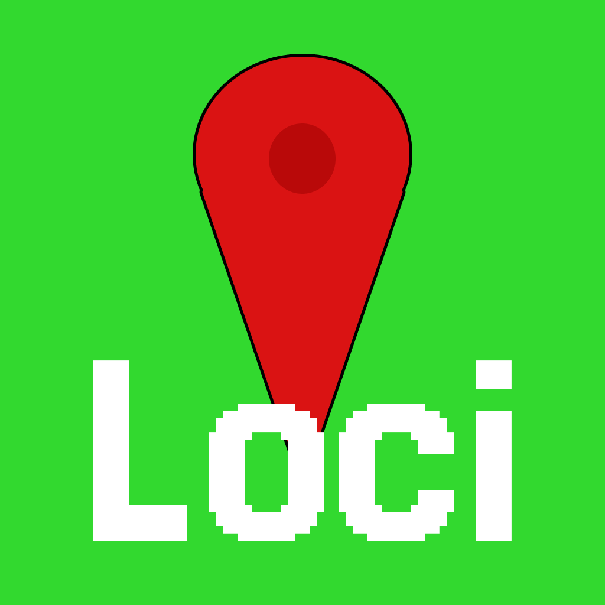

# Loci

### 忘れていたお気に入りの場所に、もう一度出会える。

---

  

  

---

## あなたの思い出が、新しい地図になる。

Lociは、あなたが見つけたお気に入りの場所や、心に残った風景を記録するための、新しい地図アプリです。
「また来たい」と思ったその気持ちを、もう二度と忘れることはありません。

### 主な機能

*   **思い出をマップに記録**
    気になる場所を見つけたら、その場で簡単登録。あなただけのスポットが地図上に増えていく楽しさを体験してください。

*   **近づくだけで再発見**
    昔登録した場所の近くを偶然通りかかると、Lociがそっと通知。忘れていたお気に入りとの、嬉しい再会が待っています。

*   **写真やタグで自分好みに**
    チェックインごとに、その日の写真や感想、評価を記録。タグ付けすれば、気分や目的に合わせていつでも簡単に見返すことができます。

## スクリーンショット

| 記録する | 再発見する | 整理する |
|:---:|:---:|:---:|
|  |  |  |
| **あなただけの場所を記録** | **忘れていたお気に入りと再会** | **写真やタグで思い出を豊かに** |

## サポート

ご意見・ご要望や不具合の報告は、以下の連絡先までお気軽にご連絡ください。

**Email:** `[torchmon@icloud.com]`

## プライバシーポリシー

Lociはユーザーのプライバシーを尊重します。詳細については、以下のリンクからプライバシーポリシーをご確認ください。

[プライバシーポリシーを読む]([https://torchmon.github.io/privacy/ten-count.html])

---
