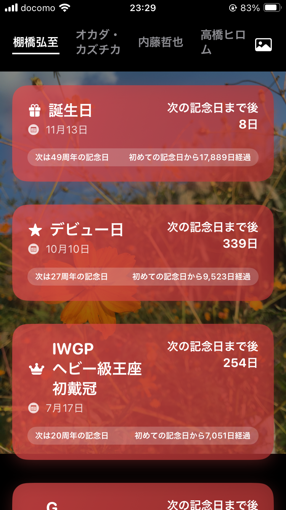
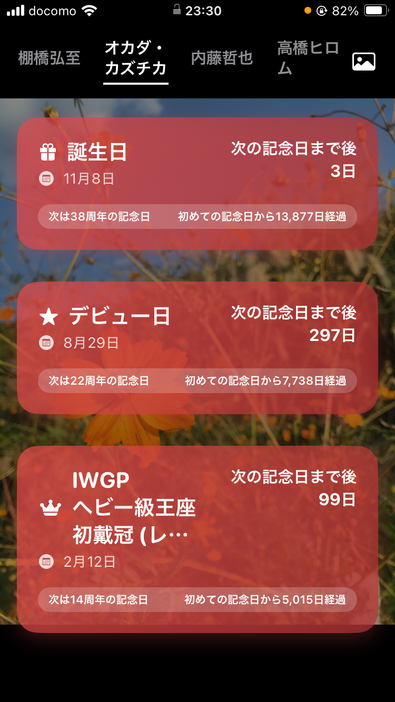

# Ten Count - 運命のゴングから、決着のテンカウントまで、そのレスラーの全ての歴史を刻む

## アプリ概要
「Ten Count」は、プロレスファンが応援する選手の記念日（誕生日、デビュー日、タイトル戴冠日など）を登録し、経過日数や次の記念日までの日数をカウントダウンすることで、日々の応援をより楽しく、特別なものにするための非公式ファンアプリです。

## 主な機能
*   **選手選択:** 好きなプロレスラーを選択し、その選手の記念日リストを閲覧できます。
*   **記念日カウントダウン:** 各記念日までの残り日数や、記念日からの経過日数を表示します。
*   **背景カスタマイズ:** お気に入りの画像をアプリの背景に設定し、自分だけの「推し」の世界観を演出できます。

## スクリーンショット

---

## ダウンロード
App Storeで「Ten Count」を検索してください。
<!-- または、App Storeのリンクをここに挿入してください -->

## プライバシーポリシー
[プライバシーポリシーはこちら](https://your-username.github.io/privacy/ten-count.html)

## お問い合わせ
ok.dodge3+tencount@gmail.com
